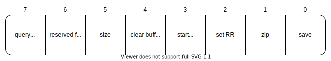
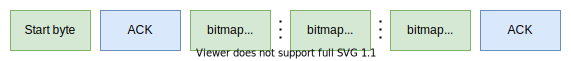
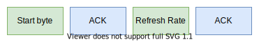
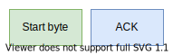
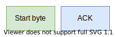

# edstream
Bitmap streaming facility for ESP32 and OLED displays.

## Setting up

Clone this project into _lib_ folder inside your PIO workspace
```
cd lib
git clone https://github.com/ITIS-Enrico-Fermi/edstream
cd ..
```

Clone _ssd1306_ library into _components_ folder inside your PIO workspace
```
mkdir components && cd components
git clone https://github.com/lexus2k/ssd1306
cd ..
```

For more information see: [https://github.com/lexus2k/ssd1306#setting-up]()

## Protocol

### Start byte


### Send bitmap


### Set refresh rate


### Clear framebuffer


### Start animation

