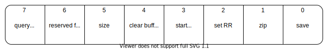
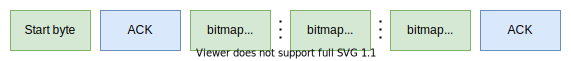
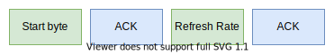
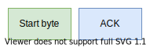

# edstream
Bitmap streaming facility for ESP32 and OLED displays.

<p align="center">

</p>

## Setting up

Clone this project into _lib_ folder inside your PIO workspace
```
cd lib
git clone https://github.com/ITIS-Enrico-Fermi/edstream
cd ..
```

Clone _ssd1306_ library into _components_ folder inside your PIO workspace
```
mkdir components && cd components
git clone https://github.com/lexus2k/ssd1306
cd ..
```
for more information see: [https://github.com/lexus2k/ssd1306#setting-up]()

Copy PlatformIO configuration for a quick setup
```
cp lib/edstream/platformio.ini .
```

```
cp lib/edstream/sdkconfig .
```

## Protocol

### Start byte


### Send bitmap


### Set refresh rate

<br> With _set_rr_ bit set to 1
<br> 1 byte payload expected

### Clear framebuffer

<br> With _clear_ bit set to 1
<br> No payload expected

### Toggle animation

<br> With _start_ / _stop_ bit set to 1
<br> No payload expected

